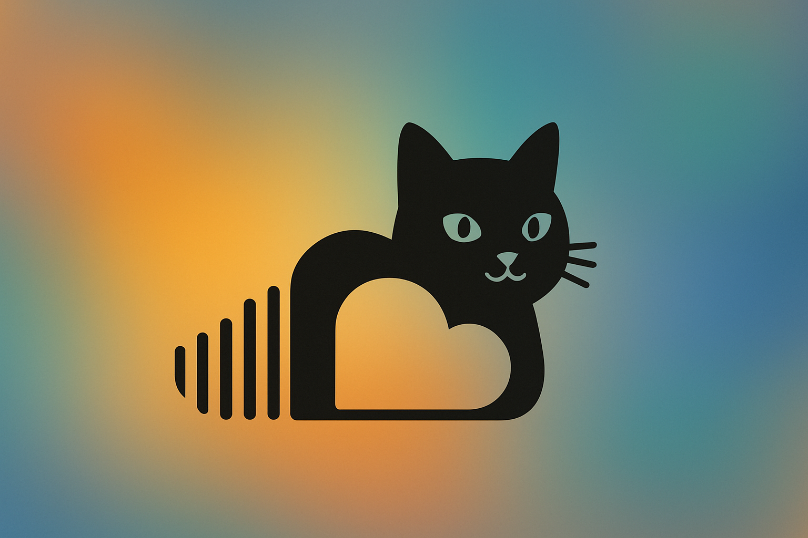

# Spotify Bot

A powerful Discord music bot built with Python that provides high-quality music playback and advanced features.

## Requirements

- Python 3.10.7
- Discord.py (disnake)
- Discord Bot Token
- Java 17 (for Lavalink)

## Features

- High-quality music playback
- Spotify integration
- Queue management
- Volume control
- Track history
- Daily mixes
- Beautiful music banners
- Slash commands support

## Setup

1. Clone the repository
2. Install dependencies:
```bash
pip install -r requirements.txt
```
3. Create a `.env` file with your Discord bot token:
```
TOKEN=your_discord_bot_token
```
4. Download Lavalink.jar and place it in the `lavalink` folder
5. Create `application.yml` in the `lavalink` folder
6. Run the bot:
```bash
python start.py
```

## Commands

- `/play` - Play a song or playlist
- `/stop` - Stop playback
- `/skip` - Skip current track
- `/queue` - Show current queue
- `/volume` - Adjust volume
- `/mix` - Create a daily mix
- `/history` - View track history

## License

This project is licensed under the MIT License - see the LICENSE file for details. 